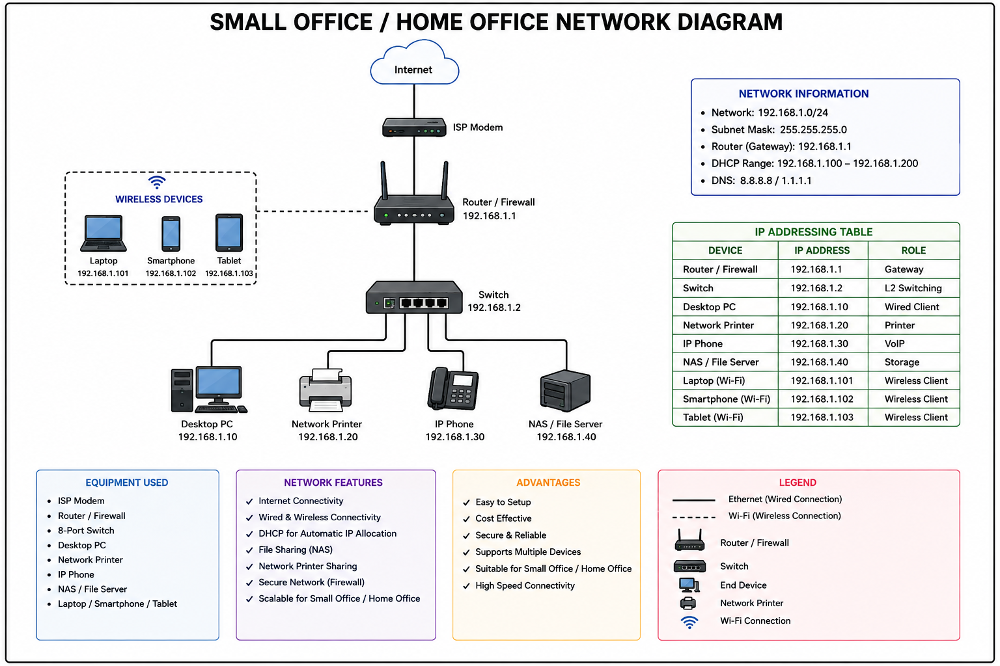

# Small Office / Home Office (SOHO) Network Design

## Overview

This project demonstrates a Small Office/Home Office (SOHO) network implemented in Cisco Packet Tracer.

The network provides both wired and wireless connectivity for office devices while maintaining a simple and scalable architecture.

## Network Topology



## Network Information

| Parameter | Value |
|------------|--------|
| Network | 192.168.1.0/24 |
| Subnet Mask | 255.255.255.0 |
| Default Gateway | 192.168.1.1 |
| DHCP Range | 192.168.1.100 - 192.168.1.200 |
| DNS | 8.8.8.8 / 1.1.1.1 |

## Devices Used

- ISP Modem
- Router / Firewall
- Layer 2 Switch
- Desktop PC
- Network Printer
- IP Phone
- NAS / File Server
- Laptop
- Smartphone
- Tablet

## IP Addressing Table

| Device | IP Address |
|----------|------------|
| Router / Firewall | 192.168.1.1 |
| Switch | 192.168.1.2 |
| Desktop PC | 192.168.1.10 |
| Network Printer | 192.168.1.20 |
| IP Phone | 192.168.1.30 |
| NAS / File Server | 192.168.1.40 |
| Laptop | 192.168.1.101 |
| Smartphone | 192.168.1.102 |
| Tablet | 192.168.1.103 |

## Features

- Wired Connectivity
- Wireless Connectivity
- DHCP Address Allocation
- Internet Access
- Network Printer Sharing
- NAS Storage Access
- VoIP Communication
- Firewall Protection

## Advantages

- Easy to Deploy
- Cost Effective
- Reliable Connectivity
- Supports Multiple Devices
- Scalable Design

## Software Used

- Cisco Packet Tracer

## Author

Suhas KV